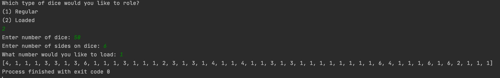

# Overview

This program will roll a specified number of dice with any number of faces, and can also roll a loaded dice that has a 50% chance of landing on a specific value.

# Development Environment
* IntelliJ IDEA
* Kotlin 1.4.9

# Execution

To execute the program: main.kt

# Useful Websites
* https://kotlinlang.org/